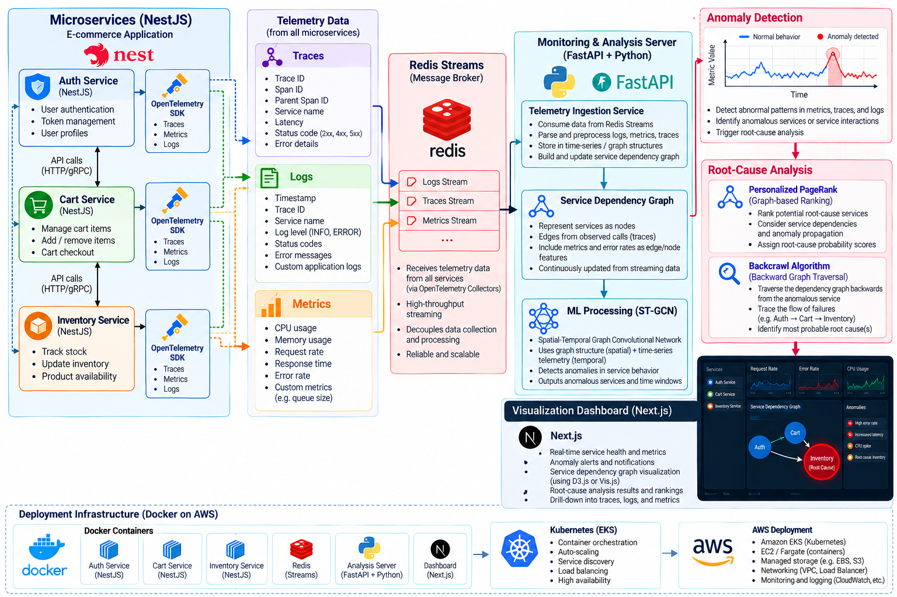

# System Architecture — Version 0.2

## 1. Architecture Diagram

*Figure 1: Preliminary architecture of the proposed microservices monitoring and root-cause detection platform.*

## 2. Overview

The proposed system aims to monitor a distributed microservices application, detect anomalous behavior, and identify potential root causes using machine-learning and graph-based analysis.

The architecture consists of application microservices, telemetry collection, a streaming pipeline, a Python-based analysis backend, machine-learning models, graph-based root-cause analysis, and a visualization dashboard.

This is a preliminary design for proposal preparation. The final architecture will be refined through literature review, feasibility analysis, and supervisor feedback.

## 3. System Components

### 3.1 Application Microservices

The initial design considers three interconnected microservices:

- **Auth Service:** Responsible for authentication and authorization.
- **Cart Service:** Handles shopping cart operations.
- **Inventory Service:** Manages product stock and availability.

NestJS is the proposed framework for implementing these application services.

### 3.2 Telemetry Collection

OpenTelemetry is proposed for collecting telemetry from the microservices.

The collected information may include:

- Distributed traces and trace IDs.
- HTTP request and response status codes.
- Request latency and error rates.
- Application logs.
- CPU and memory utilization metrics.

This telemetry will provide information about service behavior and interactions during normal operation and failures.

### 3.3 Telemetry Streaming

Redis Streams is proposed as the telemetry streaming layer between collection and analysis.

It will act as a buffer for telemetry events, allowing the analysis backend to consume incoming data asynchronously. The precise integration between OpenTelemetry Collectors and Redis Streams remains under investigation.

### 3.4 Monitoring and Analysis Backend

Python with FastAPI is proposed for the main monitoring and analysis server.

Its potential responsibilities include telemetry ingestion, preprocessing, temporal data preparation, service dependency graph construction, and coordination of machine-learning inference and root-cause analysis.

### 3.5 ST-GCN-Based Anomaly Detection

A Spatial-Temporal Graph Convolutional Network (ST-GCN) is being investigated as a potential anomaly-detection model.

The spatial component can learn relationships between connected services, while the temporal component can learn patterns that change over time. Together, these representations may help identify unusual service behavior and failure patterns.

The model architecture and its suitability will be evaluated against available datasets and baseline methods.

### 3.6 Graph-Based Root-Cause Analysis

When an anomaly is detected, graph-based analysis may help identify services that are likely to be responsible for the observed failure.

Personalized PageRank and backward graph traversal, referred to in our current design exploration as backcrawl, are candidate approaches for ranking and investigating suspicious services.

For example, if an anomaly appears in the Cart Service, the analysis could investigate its upstream dependencies, including the Auth Service, while also examining downstream effects involving the Inventory Service. The actual traversal direction and ranking strategy will depend on the dependency graph and selected algorithm.

### 3.7 Visualization Dashboard

Next.js is proposed for the monitoring dashboard. D3.js or Vis.js may be used to visualize service dependencies and root-cause analysis results.

The dashboard may display service health, anomaly alerts, telemetry trends, and ranked root-cause candidates.

### 3.8 Deployment Infrastructure

Docker is proposed for containerizing the application services and analysis components. Kubernetes on AWS EKS is being considered for orchestration and deployment, subject to project scope and feasibility.

## 4. Preliminary Technology Stack

| Component | Proposed technology |
|---|---|
| Application microservices | NestJS |
| Telemetry collection | OpenTelemetry |
| Telemetry streaming | Redis Streams |
| Analysis backend | Python, FastAPI |
| Anomaly detection | ST-GCN candidate |
| Root-cause analysis | Personalized PageRank and backward traversal candidates |
| Dashboard | Next.js |
| Graph visualization | D3.js or Vis.js |
| Containerization | Docker |
| Orchestration | Kubernetes / AWS EKS |

## 5. Open Questions

- Which dataset will best support model development and evaluation?
- How will telemetry be exported into Redis Streams?
- How will the service dependency graph be constructed and updated?
- Is ST-GCN suitable for the available telemetry and project constraints?
- Which baseline anomaly-detection methods should be evaluated?
- Which graph algorithm provides the most useful root-cause ranking?
- What deployment configuration is feasible within the available time and resources?

## 6. Current Status

**Version:** 0.2  
**Project phase:** Research and proposal preparation  
**Design status:** Preliminary; under investigation

The architecture will evolve as research findings, experiments, and supervisor feedback help establish the final scope and implementation approach.
